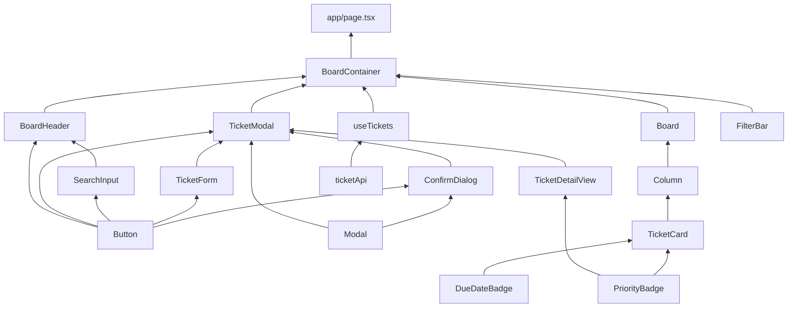

# Tika - 프론트엔드 구현 계획 (FRONTEND_TASKS.md)

> `docs/COMPONENT_SPEC.md` 기반 bottom-up 구현 순서. 말단(의존성 없는) 컴포넌트부터 시작해
> `BoardContainer` → `app/page.tsx` 순으로 올라간다.
> 관련 문서: COMPONENT_SPEC.md, REQUIREMENTS.md, TEST_CASES.md, DATA_MODEL.md

---

## 0. 진행 원칙

- **TDD 사이클** (CLAUDE.md 준수): 각 컴포넌트마다 Red(실패하는 테스트만 작성) → Green(테스트를
  통과하는 최소 구현) → Refactor(테스트는 계속 통과, 기능 추가 금지) 순서를 지킨다. 한 커밋/한
  세션에서 테스트와 구현을 동시에 작성하지 않는다.
- **경계 규칙**: 이 계획은 `src/client/`, `src/client/api/`, `src/client/hooks/`, `app/page.tsx`
  만 다룬다. `app/api/`, `src/server/`는 건드리지 않는다. `src/shared/`는 이미 `TicketWithMeta`,
  `BoardData`, `TICKET_STATUS`, `TICKET_PRIORITY`, Zod 스키마가 구현되어 있으므로 원칙적으로
  수정하지 않는다 (프론트엔드 작업 중 공유 타입 변경이 필요하다고 판단되면 먼저 별도로 논의).
- **테스트 파일 위치**: 기존 API 테스트 컨벤션(`__tests__/api/*.test.ts`)을 따라 최상위
  `__tests__/`에 영역별로 배치한다.
  - `__tests__/components/*.test.tsx` (도메인 컴포넌트), `__tests__/components/ui/*.test.tsx`
    (범용 UI 유틸리티 컴포넌트 — `src/client/components/ui/`와 구조를 맞춘다)
  - `__tests__/hooks/useTickets.test.ts`
  - `__tests__/api-client/ticketApi.test.ts`
  - `__tests__/integration/*.test.tsx` (TC-INT-*, `jest.mock`으로 `ticketApi` 모킹)
- **TC ID 매핑**: `docs/TEST_CASES.md`에 이미 정의된 TC-COMP-*/TC-INT-*는 그대로 인용한다.
  TEST_CASES.md에 없는 컴포넌트(공통 UI 프리미티브, 데이터 레이어 등)는 표에
  **"(TEST_CASES.md 미기재)"** 로 표시했다 — 해당 컴포넌트의 Red 단계 진입 전, 필요하면
  TEST_CASES.md에 TC 항목을 먼저 추가하는 것을 권장한다(임의로 지어내지 않기 위함).
- **DnD 관련 컴포넌트(TicketCard, Column, Board)**: `@dnd-kit`은 JSDOM에서 실제 포인터 드래그를
  발생시키기 어렵다. 컴포넌트 단위 테스트(TC-COMP-*)는 렌더링/클릭/키보드 상호작용까지만
  검증하고, 실제 드래그앤드롭 흐름(TC-INT-001, TC-INT-002)은 `@dnd-kit`이 제공하는 테스트
  유틸리티 또는 `fireEvent`로 시뮬레이션한 DragStart/DragEnd 콜백 테스트로 검증한다.

---

## 1. 의존성 그래프

**읽는 법**: 화살표는 "의존 대상 → 사용하는 쪽"이며, 아래(Phase 0)에서 위(Phase 5)로 갈수록
상위 컴포넌트다. `FilterBar`는 다른 커스텀 컴포넌트에 의존하지 않는 독립 리프다.

---

## 2. Phase별 작업 목록

### Phase 0 — 공통 UI 프리미티브 (외부 컴포넌트 의존성 없음)

| 컴포넌트 | 파일 | COMPONENT_SPEC 참조 |
|---|---|---|
| Button | `src/client/components/ui/Button.tsx` | §3 Button |
| PriorityBadge | `src/client/components/ui/PriorityBadge.tsx` | §3 PriorityBadge |
| DueDateBadge | `src/client/components/ui/DueDateBadge.tsx` | §3 DueDateBadge |
| Modal | `src/client/components/ui/Modal.tsx` | §3 Modal |

#### Button

**역할**: variant(primary/secondary/danger/ghost) × size(sm/md/lg), 로딩 상태 지원.

- [x] Red — `__tests__/components/ui/Button.test.tsx` (TEST_CASES.md 미기재)
  - variant별 클래스/스타일이 다르게 적용되는지 (primary/secondary/danger/ghost 각 1건)
  - `isLoading=true`일 때 클릭 불가(disabled) + 로딩 텍스트("처리중...") 표시
  - 클릭 시 `onClick` 1회 호출
  - (별도 `disabled` prop은 두지 않음 — `isLoading`이 비활성 상태를 겸함)
- [x] Green — 위 테스트를 통과하는 최소 구현 (네이티브 `<button>` + variant/size별 className 매핑)
- [x] Refactor — variant/size 클래스 매핑 테이블(`VARIANT_CLASS`/`SIZE_CLASS`) 정리 완료

**완료 조건**: 이후 모든 컴포넌트가 이 Button만 재사용하고 직접 `<button>` 스타일링을 하지 않는다.

---

#### PriorityBadge

**역할**: 우선순위 표시 — LOW(회색)/MEDIUM(파란색)/HIGH(빨간색), 작은 텍스트 + 둥근 패딩.

- [x] Red — `__tests__/components/ui/PriorityBadge.test.tsx` (TEST_CASES.md 미기재)
  - `priority="LOW"` → 회색 계열 스타일 + "LOW" 텍스트
  - `priority="MEDIUM"` → 파란색 계열 스타일 + "MEDIUM" 텍스트
  - `priority="HIGH"` → 빨간색 계열 스타일 + "HIGH" 텍스트
- [x] Green — `priority` prop 기반 색상 매핑 구현 (`app/globals.css`의 `priority-low/medium/high`
      토큰 사용)
- [x] Refactor — 색상 매핑 로직을 `PRIORITY_CLASS` 상수 객체로 추출 완료

---

#### DueDateBadge

**역할**: 마감일(dueDate)을 `YYYY-MM-DD` 형식으로 표시. `isOverdue` prop(오늘 기준 마감 초과
여부는 상위 컴포넌트가 계산해 전달)에 따라 지났으면(over-due) 붉은색, 아니면(before-due) 회색
텍스트. (당초 계획한 "컴포넌트 내부에서 날짜 비교" 방식은 09d42aa에서 `isOverdue` prop 방식으로
변경됨 — 오늘 날짜 기준 계산은 `TicketCard` 등 사용처 책임.)

- [x] Red — `__tests__/components/ui/DueDateBadge.test.tsx` (TEST_CASES.md 미기재)
  - `dueDate`를 `YYYY-MM-DD` 형식 텍스트로 표시
  - `isOverdue=true` → `text-danger` 클래스 + `data-overdue="true"`
  - `isOverdue=false` → `text-text-secondary` 클래스 + `data-overdue="false"`
- [x] Green — `isOverdue` prop 기반 색상 매핑 구현 (`app/globals.css`의 `danger`,
      `text-secondary` 토큰 사용)
- [x] Refactor — 불필요 (prop 기반으로 단순화되어 추가 정리 대상 없음)

---

#### Modal

**역할**: 오버레이 + 중앙 정렬 컨테이너, ESC/바깥 클릭 닫기, 열림/닫힘 애니메이션, body 스크롤 잠금.

- [x] Red — `__tests__/components/ui/Modal.test.tsx` (TEST_CASES.md 미기재)
  - [x] `isOpen=false`면 아무것도 렌더링하지 않음
  - [x] `isOpen=true`면 children 렌더링 (`role="dialog"`로 렌더링되는지 포함)
  - [x] ESC 키 입력 시 `onClose` 호출
  - [x] 오버레이(바깥 영역) 클릭 시 `onClose` 호출, 모달 콘텐츠 내부 클릭 시 `onClose` 미호출
  - [x] 열릴 때 `document.body`에 `body-scroll-locked` 클래스 부여, 닫히면(isOpen=false 리렌더
        또는 언마운트) 제거
- [x] Green — Portal 없이 오버레이/컨테이너 구조 구현, `useEffect` 2개로 keydown 리스너와 body
      클래스(`body-scroll-locked`) 토글을 각각 분리 구현 (`Modal.tsx`)
- [x] Refactor — 두 `useEffect` 모두 cleanup 함수 존재 확인, 추가 정리 대상 없음

**완료 조건**: `ConfirmDialog`, `TicketModal`은 직접 오버레이를 그리지 않고 이 `Modal`을 감싼다.

---

### Phase 1 — Phase 0에 의존하는 1차 리프 컴포넌트

| 컴포넌트 | 파일 | 관련 TC |
|---|---|---|
| ConfirmDialog | `src/client/components/ui/ConfirmDialog.tsx` | TC-COMP-006 |
| SearchInput | `src/client/components/SearchInput.tsx` | (TEST_CASES.md 미기재) |
| TicketDetailView | `src/client/components/TicketDetailView.tsx` | (TEST_CASES.md 미기재) |
| TicketCard | `src/client/components/TicketCard.tsx` | TC-COMP-001 |
| TicketForm | `src/client/components/TicketForm.tsx` | TC-COMP-004 |
| FilterBar | `src/client/components/FilterBar.tsx` | TC-COMP-007 |

#### ConfirmDialog

**역할**: "정말 삭제하시겠습니까?" 확인 다이얼로그. 확인 버튼은 danger variant.

- [x] Red — `__tests__/components/ui/ConfirmDialog.test.tsx` (TC-COMP-006)
  - TC-COMP-006-1: `isOpen=true`일 때 확인 메시지 + [취소]/[삭제] 버튼 표시
  - TC-COMP-006-2: [취소] 클릭 → `onCancel` 호출 (다이얼로그 닫힘은 부모 책임이므로 콜백
    호출만 검증)
  - TC-COMP-006-3: [삭제] 클릭 → `onConfirm` 1회 호출
  - 삭제 확인 버튼이 danger variant(Button)로 렌더링되는지
- [x] Green — `Modal` + `Button`(danger/secondary) 조합으로 최소 구현
- [x] Refactor — 메시지 텍스트를 prop으로 뺄지 여부 검토 (스펙상 고정 문구이므로 하드코딩 유지
      가능 — 과설계 금지)

---

#### SearchInput

**역할**: MVP에서는 비활성 placeholder (2차 구현 예정).

- [x] Red — `__tests__/components/SearchInput.test.tsx` (TEST_CASES.md 미기재)
  - `disabled` 속성이 적용된 input이 렌더링되는지
  - placeholder 텍스트가 표시되는지
- [x] Green — `disabled` input 렌더링만 하는 최소 구현 (상태/이벤트 핸들러 없음 — 2차 구현
      범위를 넘어서지 않는다)
- [x] Refactor — 불필요

> **"새 업무" 버튼 / "삭제" 버튼**: `Button`을 얇게 감싸기만 하는 것에 불과해 독립 컴포넌트로
> 두기엔 과도하다고 판단해 제거했다. 각각 사용처(BoardHeader, TicketModal)에서 `Button`
> (primary/danger variant)을 인라인으로 직접 사용한다 — 아래 BoardHeader, TicketModal 절 참고.

---

#### TicketDetailView

**역할**: 읽기 전용 필드(상태, 시작일, 종료일, 생성일) 표시.

- [x] Red — `__tests__/components/TicketDetailView.test.tsx` (TEST_CASES.md 미기재,
      COMPONENT_SPEC §2.7 표시 필드 기준)
  - `status`, `startedAt`, `completedAt`, `createdAt` 값이 화면에 표시됨
  - `startedAt`/`completedAt`이 `null`이면 "-" 표시
  - 편집 UI(입력/버튼)가 전혀 없음 (읽기 전용 확인)
- [x] Green — 값 포맷팅(날짜 → 표시 형식) 포함한 최소 구현
- [x] Refactor — 날짜 포맷 함수가 여러 곳에서 필요해지면 `src/client/` 내 공용 유틸로 추출
      (아직은 1곳에서만 쓰이므로 인라인 유지 — 조기 추상화 금지)

---

#### TicketCard

**역할**: 개별 티켓 카드, 드래그 소스 (`useSortable`).

- [x] Red — `__tests__/components/TicketCard.test.tsx` (TC-COMP-001)
  - TC-COMP-001-1: title, `[HIGH]` 뱃지, dueDate 텍스트 표시
  - TC-COMP-001-2: `isOverdue=true` → 경고 표시 렌더링
  - TC-COMP-001-3: `isOverdue=false` → 경고 표시 없음
  - TC-COMP-001-4: `dueDate=null` → 날짜 영역 미렌더링
  - TC-COMP-001-5: 카드 클릭 → `onClick` 1회 호출
  - 접근성: `role="button"`, `aria-label="티켓: {title}"`, Tab 포커스 가능, Enter로 `onClick` 호출
- [x] Green — `useSortable` 연결(드래그 자체는 이 단계에서 시각 스타일만, 실제 DnD 통합은
      Phase 4 Board에서 검증), PriorityBadge, DueDateBadge 재사용, 오버듀 시 `app/globals.css`의 danger 톤 테두리 적용
- [x] Refactor — 드래그 중 반투명/그림자 스타일과 정적 스타일 분리 정리 (`DRAGGING_CLASS`/`OVERDUE_CLASS` 상수로 분리 완료)

**주의**: `onClick`은 드래그 제스처와 구분해야 한다(COMPONENT_SPEC §2.6) — `useSortable`의
`isDragging` 또는 dnd-kit의 클릭/드래그 구분 패턴(activation constraint)을 Green 단계에서 반영.

---

#### TicketForm

**역할**: 생성/수정 공용 폼. `mode` prop으로 분기.

- [x] Red — `__tests__/components/TicketForm.test.tsx` (TC-COMP-004, 생성 모드 기준. 수정 모드
      데이터 바인딩은 TC-COMP-005-1과 겹치므로 TicketModal 테스트에서 통합 검증)
  - TC-COMP-004-1: `mode="create"` → title 빈칸, priority "MEDIUM" 기본 선택
  - TC-COMP-004-2: title 빈 값으로 저장 시도 → "제목을 입력해주세요" 인라인 에러
  - TC-COMP-004-3: 유효한 입력 후 저장 → `onSubmit` 호출
  - TC-COMP-004-4: 취소 클릭 → `onCancel` 호출
  - `isLoading=true` → 제출 버튼 비활성화 + 로딩 스피너
  - description 1000자 초과 / dueDate 과거 날짜 → 각각의 에러 메시지 표시 (REQUIREMENTS.md
    검증 에러 메시지 표)
- [x] Green — `src/shared/validations/ticket.ts`의 `createTicketSchema`/`updateTicketSchema`로
      클라이언트 사이드 검증, `Button` 재사용 (`<form>` 대신 `
` 컨테이너 + 저장 버튼
      `onClick`으로 제출 로직 호출 — `Button`에 `type` prop을 추가하지 않고도 취소 버튼의
      의도치 않은 submit 문제를 피함)
- [x] Refactor — 필드별 에러 표시 로직을 `FieldError` 헬퍼 컴포넌트로 중복 제거

---

#### FilterBar

**역할**: "이번주 업무" / "일정 초과" 토글 필터. 다른 커스텀 컴포넌트에 의존하지 않는 독립 리프.

- [x] Red — `__tests__/components/FilterBar.test.tsx` (TC-COMP-007)
  - TC-COMP-007-1: 두 버튼 렌더링
  - TC-COMP-007-2: [이번주 업무] 클릭 → `onFilterChange('thisWeek')` 호출 + 강조 스타일
  - TC-COMP-007-3: 활성 버튼 재클릭 → `onFilterChange('all')` 호출
  - TC-COMP-007-4: 다른 필터로 전환 → `onFilterChange('overdue')` 호출
  - `counts` prop 값이 버튼에 표시되는지 (있다면)
- [x] Green — `activeFilter` 기반 강조 스타일(`Button` variant 전환) + 클릭 핸들러 최소 구현
- [x] Refactor — 두 필터를 `FILTERS` 배열 매핑으로 바로 작성(중복 없음) — 별도 정리 불필요

---

### Phase 2 — Phase 1에 의존하는 2차 조합 컴포넌트

| 컴포넌트 | 파일 | 관련 TC |
|---|---|---|
| TicketModal | `src/client/components/TicketModal.tsx` | TC-COMP-005, TC-COMP-006(통합) |
| Column | `src/client/components/Column.tsx` | TC-COMP-002 |
| BoardHeader | `src/client/components/BoardHeader.tsx` | TC-COMP-003 (일부) |

#### TicketModal

**역할**: 상세 표시 + 인라인 편집 + 삭제. `Modal` + `TicketDetailView` + `TicketForm` +
삭제 버튼(`Button` danger variant, 인라인) + `ConfirmDialog` 조합.

- [x] Red — `__tests__/components/TicketModal.test.tsx` (TC-COMP-005)
  - TC-COMP-005-1: 기존 `ticket` 데이터로 폼/상세 필드 초기화 (title, priority 등)
  - TC-COMP-005-2: 필드 수정 → 저장 클릭 → `onUpdate(id, data)` 호출, 모달은 닫히지 않음
    (`isOpen`은 부모 상태이므로 `onClose` 미호출로 검증)
  - TC-COMP-005-3: [삭제] 버튼 존재
  - TC-COMP-006-1~3 통합: [삭제] 클릭 → `ConfirmDialog` 표시 → 확인 시 `onDelete(id)` 호출,
    취소 시 `onDelete` 미호출
  - `status`/`startedAt`/`completedAt`/`createdAt`은 `TicketDetailView`를 통해 읽기 전용으로
    표시 (편집 불가 확인)
  - ESC/바깥 클릭 시 `onClose` 호출 (Modal 위임 동작이 실제로 연결됐는지)
- [x] Green — 각 하위 컴포넌트를 조합하고("삭제" 버튼은 `Button`(danger)을 직접 인라인 렌더링),
      삭제 확인 다이얼로그 열림 여부를 로컬 state로 관리
- [x] Refactor — 불필요 (조합만 하는 얇은 컴포넌트라 추가 정리 대상 없음). 삭제 확인
      다이얼로그가 열려 있는 동안에는 바깥 "삭제" 트리거 버튼을 숨겨 접근성 이름 중복을 피함

---

#### Column

**역할**: 단일 칼럼의 카드 목록 + 드롭 영역 (`SortableContext` + `useDroppable`).

- [x] Red — `__tests__/components/Column.test.tsx` (TC-COMP-002)
  - TC-COMP-002-1: 칼럼명 + 카드 수 표시 (예: "BACKLOG", "3")
  - TC-COMP-002-2: `tickets` 2개 → 카드 제목 2개 렌더링
  - TC-COMP-002-3: `tickets=[]` → "이 칼럼에 티켓이 없습니다" 안내 + 카드 수 0
  - 카드 클릭 시 `onTicketClick(ticket)` 호출 (TicketCard 위임 확인)
- [x] Green — `TicketCard` 목록 렌더링 + `SortableContext`/`useDroppable` 연결 (DnD 컨텍스트가
      필요하므로 테스트 시 `DndContext`로 래핑). PointerSensor는 `activationConstraint` 없이는
      pointerdown에서 바로 preventDefault를 호출해 뒤따르는 click을 막으므로, 테스트의
      `DndContext`에 distance 제약을 둔 sensor를 구성해 클릭 테스트가 가능하게 함 (Board도
      동일하게 구성 필요 — Phase 4에서 유지)
- [x] Refactor — 불필요 (BACKLOG/TODO/IN_PROGRESS/DONE 모두 동일 렌더링 로직이라 칼럼별 특수
      분기가 아직 없음 — 조기 분리 금지)

---

#### BoardHeader

**역할**: 검색(placeholder) + "새 업무" 버튼.

- [x] Red — `__tests__/components/BoardHeader.test.tsx` (TC-COMP-003 중 -2 관련 부분만: 버튼
      존재 및 클릭 위임. 모달이 실제로 열리는지는 BoardContainer 레벨에서 TC-COMP-003-2로 검증)
  - `SearchInput`(비활성) 렌더링
  - "새 업무" 버튼 렌더링, 클릭 시 `onCreateClick` 1회 호출
- [x] Green — `SearchInput` + "새 업무" 버튼(`Button` primary variant, 인라인) 배치
- [x] Refactor — 불필요

---

### Phase 3 — 데이터 레이어 (UI 비의존, 인프라)

| 대상 | 파일 |
|---|---|
| ticketApi | `src/client/api/ticketApi.ts` |
| useTickets | `src/client/hooks/useTickets.ts` |

#### ticketApi

**역할**: 모든 fetch 호출을 캡슐화. 컴포넌트/훅에서 직접 `fetch` 금지 (CLAUDE.md, COMPONENT_SPEC
§4).

- [x] Red — `__tests__/api-client/ticketApi.test.ts` (TEST_CASES.md 미기재 — TC-API-*를
      클라이언트 관점에서 재사용: 각 함수가 올바른 URL/메서드/바디로 요청하고 응답을 파싱하는지)
  - `createTicket(data)` → `POST /api/tickets`, 201 응답 파싱
  - `getBoard()` → `GET /api/tickets`, `BoardData` 형태 파싱
  - `updateTicket(id, data)` → `PATCH /api/tickets/:id`
  - `removeTicket(id)` → `DELETE /api/tickets/:id`, 204 처리
  - `reorderTicket(ticketId, status, position)` → `PATCH /api/tickets/reorder`
  - `completeTicket(id)` → `PATCH /api/tickets/:id/complete`
  - 각 함수의 실패 응답(400/404) 시 에러를 throw/반환하는 공통 에러 처리 검증
- [x] Green — 전역 `fetch`를 `jest.fn()`으로 모킹해 위 함수들을 `fetch` 기반으로 구현
      (에러 응답 형식 `{ error: { code, message } }` 파싱 포함, `ApiError` 클래스로 throw)
- [x] Refactor — 공통 fetch 래퍼(`request<T>`: 204 처리, JSON 파싱, 에러 throw)로 6개 함수의
      중복 제거 완료

---

#### useTickets

**역할**: 티켓 CRUD + 낙관적 업데이트 상태 관리 (COMPONENT_SPEC §4).

- [x] Red — `__tests__/hooks/useTickets.test.ts` (TEST_CASES.md 미기재 — `@testing-library/react`의
      `renderHook` 사용, `jest.mock('@/client/api/ticketApi')`로 API 모킹)
  - `create` 성공 시 `board.backlog` 맨 앞에 낙관적으로 추가되고, 성공 응답으로 확정됨
  - `update` 성공 시 해당 티켓 필드만 갱신
  - `remove` 성공 시 board에서 제거
  - `reorder` 성공 시 대상 칼럼/포지션 반영
  - `complete` 성공 시 `done` 칼럼으로 이동, `completedAt` 반영
  - **롤백**: API가 500을 반환하면 낙관적 업데이트 이전 상태로 복원되고 `error`가 설정됨
    (TC-INT-001-4, TC-INT-002 롤백 시나리오의 훅 레벨 검증)
- [x] Green — 백업 → 낙관적 반영 → API 호출 → 성공 시 확정/실패 시 롤백 패턴 구현
      (COMPONENT_SPEC §4 낙관적 업데이트 패턴 그대로)
- [x] Refactor — 5개 액션에 공통된 "백업/낙관적 반영/롤백" 로직을 `runAction` 내부 헬퍼로 추출,
      보드 조작(칼럼 탐색/삽입/삭제/치환)도 `findTicketInBoard`/`removeTicketFromBoard`/
      `moveTicketIntoBoard`/`mapTicketInBoard`로 공통화 완료

---

### Phase 4 — 보드 오케스트레이션

| 컴포넌트 | 파일 | 관련 TC |
|---|---|---|
| Board | `src/client/components/Board.tsx` | TC-INT-001, TC-INT-002 (일부) |
| BoardContainer | `src/client/components/BoardContainer.tsx` | TC-COMP-003, TC-INT-001~003 |

#### Board

**역할**: `DndContext` + `DragOverlay`로 4개 `Column`(Backlog 사이드바 + 3칼럼) 배치.

- [x] Red — `__tests__/components/Board.test.tsx` (TEST_CASES.md 미기재 — TC-INT-001-3의 렌더링
      측면만 컴포넌트 단위로 선검증하고, 실제 이동 결과는 BoardContainer 통합 테스트에서 검증).
      jsdom이 네이티브 `PointerEvent`를 지원하지 않아 실제 포인터 드래그 물리를 `fireEvent`로
      재현할 수 없으므로, `@dnd-kit/core`의 `DndContext`/`DragOverlay`만 부분 모킹해
      `onDragStart`/`onDragEnd` 콜백을 직접 호출하는 방식으로 검증 (FRONTEND_TASKS.md 0장의
      "DragStart/DragEnd 콜백 테스트" 지침 적용)
  - `board` prop의 4개 칼럼(backlog/todo/inProgress/done)이 각각 `Column`으로 렌더링됨
  - 드래그 시작(`onDragStart` 트리거) 시 `DragOverlay`에 활성 카드가 표시됨
  - 카드 클릭 시 `onTicketClick` 위임 확인
- [x] Green — `DndContext`/`DragOverlay` 배치, `Column` 4개 렌더링, 반응형 레이아웃(desktop
      1024px~ 4칼럼(`lg:grid-cols-4`), tablet 768px~ 2칼럼(`md:grid-cols-2`), mobile 360px~
      단일 칼럼(기본 `grid-cols-1`))은 Tailwind 브레이크포인트로 구현. `PointerSensor`는 Column과
      동일하게 `activationConstraint: { distance: 8 }`로 구성해 클릭/드래그를 구분. `DragOverlay`
      복제 카드는 `TicketCard`를 재사용하지 않고 별도 프리젠테이션 컴포넌트(`TicketCardPreview`)로
      구현 — `TicketCard`가 내부에서 `useSortable`을 호출하므로 그대로 재사용하면 원본과 같은
      티켓 id로 dnd-kit `draggableNodes` 등록이 충돌하기 때문
- [x] Refactor — `onDragEnd`에서 대상 칼럼 판별 로직은 `Board`가 아니라 `BoardContainer`가
      소유하도록 책임 분리 재확인 (COMPONENT_SPEC §2.1 — API 분기는 BoardContainer 책임). `Board`의
      `handleDragEnd`는 `activeId` 초기화 후 `onDragEnd` prop으로 이벤트를 그대로 전달만 하고
      대상 칼럼/상태 판별 로직을 갖지 않음을 확인

---

#### BoardContainer

**역할**: 최상위 상태 관리 + DnD 이벤트 → `useTickets` 액션 분기 + 모달 제어.

- [x] Red — `__tests__/components/BoardContainer.test.tsx` (TC-COMP-003). `@/client/api/ticketApi`만
      모킹하고 실제 `useTickets`/`Board`/`Column`/`TicketCard`는 그대로 사용 (DnD 이벤트 배선은
      아래 통합 테스트에서 별도 검증)
  - TC-COMP-003-1: BACKLOG/TODO/IN PROGRESS/DONE 칼럼명 모두 표시
  - TC-COMP-003-2: "새 업무" 클릭 → 생성 모드 `TicketForm` 모달 렌더링
  - TC-COMP-003-3: FilterBar("이번주 업무"/"일정 초과") 표시
  - 카드 클릭 → `TicketModal` 오픈 (수정 모드)
  - 필터 적용 시 TODO/IN_PROGRESS만 필터링되고 BACKLOG는 항상 전체 표시 (COMPONENT_SPEC §2.3)
  - `isThisWeek`/`isOverdueTicket` 순수 함수 자체에 대한 단위 테스트(월요일 시작 기준 이번 주
    범위, BACKLOG/DONE 제외, dueDate 없음)도 함께 작성
- [x] Green — `useTickets` 연결, `activeFilter` 상태로 클라이언트 사이드 필터링, 생성/수정 모달
      상태(`isCreating`/`selectedTicket`) 관리. `useTickets.error`를 `role="alert"` 배너로 노출해
      TC-INT-001-4의 "에러 메시지 표시"를 충족
- [x] Refactor — 필터 로직(`isThisWeek` 등)을 순수 함수로 분리해 별도 유닛 테스트 가능하게 정리
      완료 (`BoardContainer.tsx` 상단에 `isThisWeek`/`isOverdueTicket`/`getMonday`/`getSunday`/
      `toDateString`으로 분리)

- [x] Red — `__tests__/integration/dragAndDrop.test.tsx` (TC-INT-001, `jest.mock('@/client/api/ticketApi')` 사용).
      Board.test.tsx와 동일하게 `@dnd-kit/core`의 `DndContext`/`DragOverlay`만 부분 모킹해
      `onDragEnd` 콜백을 직접 호출하는 방식으로 검증 (jsdom이 네이티브 `PointerEvent`를 지원하지
      않아 실제 포인터 드래그 물리를 재현할 수 없음)
  - TC-INT-001-1: BACKLOG → TODO 드래그 → 카드가 TODO에 표시, `PATCH /api/tickets/reorder` 호출
  - TC-INT-001-2: 칼럼 내 순서 변경 → reorder 호출
  - TC-INT-001-3: 드래그 중 원위치 반투명 placeholder + `DragOverlay` 렌더링 — 실제 포인터 물리가
    필요해 이 방식으로 재현 불가하므로 `__tests__/components/Board.test.tsx`의 컴포넌트 단위
    테스트로 이미 검증 완료 (Phase 4 Board 절 참고)
  - TC-INT-001-4: API 500 응답 → 카드가 원래 칼럼으로 복귀 + 에러 메시지 표시
- [x] Green — `onDragEnd`에서 대상이 DONE이 아니면 `useTickets.reorder` 호출. `resolveDropTarget`
      헬퍼로 `over.id`(칼럼 상태값 또는 다른 티켓 id)로부터 대상 칼럼/삽입 인덱스를 계산해
      `ticketService`의 0-based 삽입 인덱스 계약에 맞춤
- [x] Refactor — 불필요(이미 Board/useTickets 단계에서 구현됨 — 통합 테스트로 배선만 확인)

- [x] Red — `__tests__/integration/completeTicket.test.tsx` (TC-INT-002, `jest.mock('@/client/api/ticketApi')` 사용)
  - TC-INT-002-1: DONE으로 드래그 → `PATCH /:id/complete` 호출, DONE 칼럼에 표시
  - TC-INT-002-2: DONE → IN_PROGRESS로 드래그 → `PATCH /api/tickets/reorder` 호출
  - DONE → BACKLOG로 드래그 → `PATCH /api/tickets/reorder` 호출 (회귀 테스트, 아래 버그 수정 참고)
  - TC-INT-002-3: DONE 이동 후 완료 표시(✓) 렌더링 — PRD.md §7 와이어프레임 기준으로
    `TicketCard`에 `status === 'DONE'`일 때 `완료 ✓`(`data-testid="ticket-complete-mark"`) 표시를
    추가 (기존 TC-COMP-001 테스트는 모두 `status: "TODO"` 기준이라 회귀 없음)
- [x] Green — `onDragEnd`에서 대상이 DONE이면 `useTickets.complete` 호출하도록 배선.
      **분기는 반드시 드롭 대상(target) 칼럼 기준**(`target.status === 'DONE'`)이어야 한다 —
      최초 구현 시 `activeTicket.status === 'DONE' || target.status === 'DONE'`(출발 칼럼 기준)으로
      작성했는데, 이 경우 DONE 카드를 BACKLOG/TODO로 드롭해도 `useTickets.complete()`가 드롭
      위치와 무관하게 항상 IN_PROGRESS로 토글해버리는 버그가 있었다(2026-08-16 실사용 중 발견).
      target 기준으로 수정: target === DONE → `complete()`, 그 외 → `reorder()` (COMPONENT_SPEC.md
      §5.1과 일치)
- [x] Refactor — 불필요
- [x] **백엔드 수정 완료 (2026-08-16)**: `src/server/services/ticketService.ts`의 `reorder()`가
      `startedAt`만 조정하고 `completedAt`은 초기화하지 않던 문제를 수정했다 (COMPONENT_SPEC.md
      §5.1 "completedAt 규칙 적용(Done에서 나올 때 초기화)" 위반이었음). `reorderTicketSchema`는
      target status로 DONE을 허용하지 않으므로, `previousStatus === 'DONE'`이면 이 이동은 항상
      "Done에서 나가는" 이동이라는 뜻이다 — 이 경우 `completedAt: null`을 함께 저장하도록
      `startedAt`과 동일한 패턴으로 추가. `__tests__/api/tickets-reorder.test.ts`에 TC-API-007-8/9
      (DONE→BACKLOG, DONE→IN_PROGRESS 모두 completedAt 초기화 확인) 추가, `docs/TEST_CASES.md`
      TC-API-007 표에도 반영

- [x] Red — `__tests__/integration/deleteTicket.test.tsx` (TC-INT-003, `jest.mock('@/client/api/ticketApi')` 사용).
      드래그가 없는 흐름이라 `@dnd-kit` 모킹 없이 실제 컴포넌트 트리 그대로 사용
  - TC-INT-003-1: 카드 클릭 → [삭제] → [확인] → `DELETE /:id` 호출, 카드 제거, 모달 닫힘
  - TC-INT-003-2: [삭제] → [취소] → `DELETE` 미호출, 카드/모달 유지
- [x] Green — `TicketModal.onDelete` → `useTickets.remove` → 성공 시 `selectedTicket=null`로
      모달 닫기 배선
- [x] Refactor — 불필요

**완료 조건**: Phase 4가 끝나면 TEST_CASES.md의 TC-COMP-*, TC-INT-* 전체가 통과한다.

---

### Phase 5 — 페이지 엔트리

| 대상 | 파일 |
|---|---|
| page.tsx | `app/page.tsx` (기존 파일 수정) |

#### page.tsx

**역할**: 서버 컴포넌트. 초기 보드 데이터를 조회해 `BoardContainer`에 전달.

- [ ] Red — `__tests__/components/page.test.tsx` 또는 서버 컴포넌트 특성상 유닛 테스트 대신
      수동 확인으로 대체 가능 (TEST_CASES.md 미기재). 유닛 테스트를 작성한다면:
  - 초기 데이터 fetch 함수가 실패해도 페이지가 크래시하지 않고 빈 보드로 폴백하는지
- [ ] Green — 서버에서 티켓 조회(내부적으로 `src/server/services/ticketService`를 직접 호출하거나
      기존 `GET /api/tickets`를 fetch — 프로젝트의 서버 컴포넌트 데이터 페칭 관례에 맞춰 결정)
      → `BoardContainer initialData={board}` 렌더링
- [ ] Refactor — 불필요

- [ ] **수동 검증 (필수)**: CLAUDE.md 규칙상 UI 변경은 브라우저에서 실제로 동작을 확인해야 한다.
      `npm run dev`로 실행해 다음을 확인:
  - 4개 칼럼 정상 표시, 반응형 레이아웃(360/768/1024px) 확인
  - 생성 → 드래그 이동 → 수정 → 완료(Done) → 삭제 전체 골든 패스
  - 오버듀 카드 시각 표시, 필터 토글, 키보드 포커스/Enter 상호작용(NFR-003)

---

## 3. Phase 요약

| Phase | 성격 | 컴포넌트/대상 |
|---|---|---|
| 0 | 공통 UI 프리미티브 | Button, PriorityBadge, DueDateBadge, Modal |
| 1 | 1차 리프 (Phase 0 의존) | ConfirmDialog, SearchInput, TicketDetailView, TicketCard, TicketForm, FilterBar |
| 2 | 2차 조합 | TicketModal, Column, BoardHeader |
| 3 | 데이터 레이어 | ticketApi, useTickets |
| 4 | 보드 오케스트레이션 | Board, BoardContainer (+ 통합 테스트 3종) |
| 5 | 페이지 엔트리 | app/page.tsx (+ 수동 브라우저 검증) |

Phase 내부 컴포넌트끼리는 서로 의존하지 않으므로 병렬 작업이 가능하지만, Phase 간 순서(0 → 1 →
2 → 3 → 4 → 5)는 지켜야 한다. 단, **Phase 3(데이터 레이어)은 Phase 1~2와 독립적**이므로 UI
작업과 동시에 진행해도 무방하다 — Phase 4에서 둘이 합류한다.
